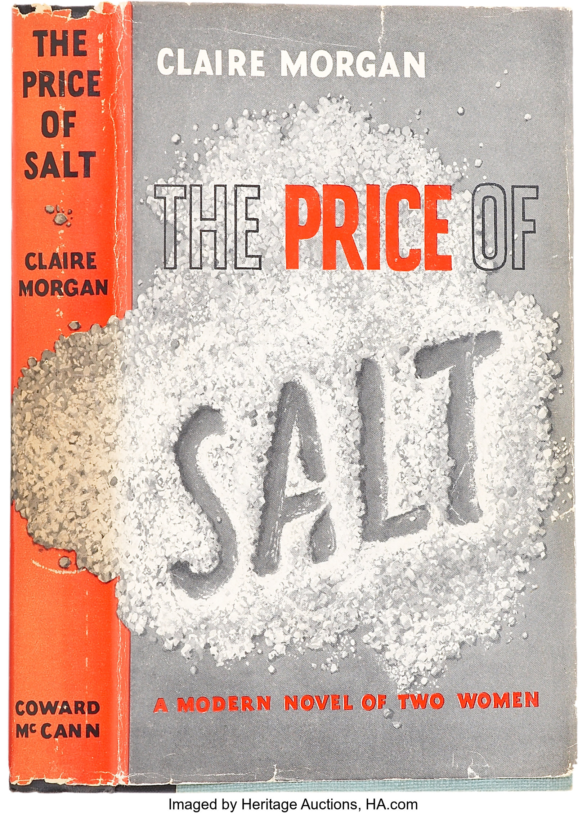

*The Price of Salt*, written in 1952 by Patricia Highsmith under the pseudonym Claire Morgan is a romance novel that follows the story of Therese, an aspiring stage designer in New York who falls in love with Carol, a housewife in the middle of a divorce and vicious battle over the custody of her daughter. What ensues is a tale of finding oneself, the complicated matter of love and a heart-breaking observation of the social attitudes towards same-sex relationships at that time. The book has since been republished as *Carol* as well as being adapted into a movie in 2015 and published as an ebook and audiobook. The repeated republishing of hard copies since 1952 has inevitably resulted in a plethora of book covers, all of which brandish different typefaces that reflect attitudes towards the book and its themes over time.

## 1952 (1st) Edition

The first edition of *The Price of Salt* was published by Coward McCann Publishing as a hardback. The immediate impression of the book cover is that it appears to be a crime novel rather than a romance. The highlighting of the word 'price' in red provides a suggestion of danger and risk or consequences of actions, contrasting with the words bookending it that are merely outlined in black. The unstructured pile of salt is disturbed by the word 'salt' drawn into it in a slightly slanted, non-cursive font that appears to be drawn with a finger; much like hurried messages left at the scene of a crime in psychological murder mysteries. The upright, simple and structured design of the rest of the cover's typeface adds to the serious tones of the design, a far cry from the flowing, cursive font you might expect from a romance book regarding two feminine women such as Therese and Carol.

So why did Highsmith and Coward McCann choose such a misleading design? Well the most obvious may be that they didn't want to bring too much unwanted attention to it given its controversy at the time so disguised it with a less appealing cover that would not prompt romance fanatics to pick it up unless they were seeking it, as well as protect them from questions regarding its place on their bookshelf (for example sapphic readers, closeted or otherwise). Alternatively, it may be that in some ways Highsmith saw the novel as of the same kind as her other works. She was primarily a crime writer, specialising in psychological thrillers (such as *The Talented Mr. Ripley*) that provided a criminal protagonist who went through a transformation that blurred the lines between moral and immoral, acceptable and unacceptable, much like Therese goes through a transformation as she discovers she loves Carol, forcing the reader to question whether her love for another woman can truly be immoral knowing how she came to love her.

"\[Their] desire to transform through a transgression is something Therese and Carol have in common with Tom Ripley from Highsmith’s Ripley series and, a bit more obliquely, Guy Haines from *Strangers on a Train*. Although unlike Ripley and Haines, Therese and Carol never commit a murder or even a violent act, Highsmith has woven a sense of menace through the novel." - John Copenhaver 2015 in "Is Patricia Highsmith's lesbian classic 'The Price of Salt' crime fiction?"