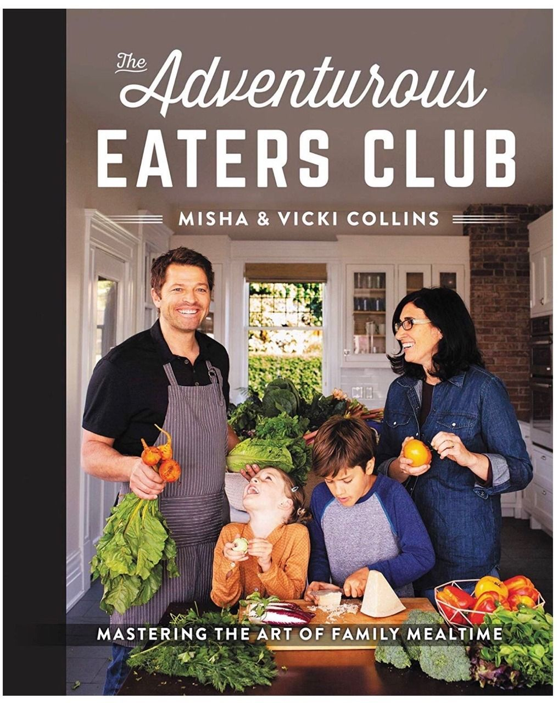

Recipe books may not be works of literature recounting tales of bravery or revolving around a tumultuous romantic relationship but they are still incredibly popular despite the current digital age of free online recipes. Recipe books are thought to have been published and sold commercially since the 4th century onwards (*Culinary Matters* by a Roman man called Apicius being one of the earliest recorded), though recipes have been recorded for personal use since long Before Christ. One of the most well known historical recipe books is *Mrs Beeton's Book of Household Management*. Originally published in 1861and still in print today, it covered everything from cooking meals and preparing sauces and jams to organising the household's taxes. Modern recipe books no longer cover such a wide range of housekeeping, particularly because the role of housekeeping and indeed cooking is no longer constrained to the women of the house or its staff. Cookbooks are now often aimed at specific age or economic groups, or cover a specific type of food such as vegetarian meals. Cooking is also considered not just as a profession or necessity now, but also a hobby ands so the design of recipe book covers has become much more important in aiming to catch a browsing buyer's eye. 

The two recipe books I will be looking at are aimed at entirely different demographics; *The Adventurous Eaters Club* by Misha and Vicki Collins is a celebrity cookbook aimed at encouraging cooking as a family activity, while *The Hungry Student One Pot Cookbook* is (as its title suggests) aimed at students living alone who want to make simple but nutritious meals that require minimal washing up.

## *The Adventurous Eaters Club*

As previously mentioned, *The Adventurous Eaters Club* is aimed at encouraging family cooking, particularly healthy family cooking. This is clearly evident from a first glance at the book's cover design; it displays an image of the writers in their kitchen with their children, surrounded by green and leafy vegetables. All of them are smiling and looking carefree except the son, who is instead extremely concentrated on cutting a block of cheese. 

Looking deeper, the some of the typography is equally carefree while other parts look curiously formal and out of place. There are two main typefaces on the front cover; '*The Adventurous'* is cursive and free flowing, while the rest of the text is structured and fully capitalised. All of the text is white and frames the busiest part of the cover's image, presumably in an attempt not to take too much attention from the photo. This is likely because of the celebrity authorship of the book, as a TV star, much of Misha's marketing and advertisement reached fans of his acting work, so his presence on the cover is an important selling point. 

When focusing solely on the text on the cover and ignoring the image, the fact that *'The Adventurous'* is the only text with a different font draws attention to it, highlighting the theme of the book's recipes as 'adventurous' and fun. This provides an explanation for the less than adventurous design of the rest of the text, as rather than aiming to provide another interpretation of the book's purpose, the structurally plain text aims more to take as little attention away as possible from the main word of the title.