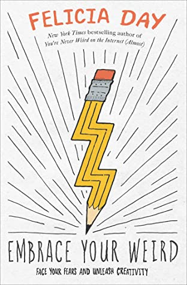

There are a lot of mixed attitudes towards so called 'self help books', books that aim to take aspects of psychology and its theories and use them to advise and encourage people to look within themselves and find ways to enhance their strengths and understand themselves better to better their mental and physical quality of life. While popularly sold in western countries, some feel that they promise a pipe dream and are less effective than they claim to be in improving people's lives. It is therefore important that publishers design covers for such books in a way that project relatability and informality or friendliness as opposed to cold, scientific professionalism in order to attract the average person.

The two following books do just that in quite different ways:

## Notes on A Nervous Planet

*Notes on A Nervous Planet* by Matt Haig functions as a book of simplistic, short 'how to' chapters that aim to help the reader learn how to live in a modern technologically interconnected world without compromising their wellbeing and mental health. The 2019 paperback cover design reflects that well. It features a plain black background behind white text and a gradient multicoloured wavy line travelling from the top righthand corner to the bottom left where it continues off page. 

The text itself is left aligned and almost fully capitalised, not including the review quotes and the author's name. The straight, thin lines of the title lack any serifs and make for a simple, easy to read layout that effectively embodies the contents of the book and effectively ensures it doesn't overwhelm the reader/browser - just as the book itself aims to help the reader avoid being overwhelmed in their life. In fact the only gimmick in the text is the the filling of the reviewer's names with different colours, serving to add a pop of colour to catch a potential buyer's eye, and a white and grey image of the earth used to represent the 'O' in 'nervous'.

The lack of colour in the image not only allows it to blend well with the rest of the text but represents the state of society currently that the book highlights; devoid of colour, anxious, stressed and unable to look up from technology as a branch to work, news and a connectivity we feel we can only get from 24/7 technological access. The multicoloured line that floats across the page, wrapping around the earth may then be interpreted as a lifeline of sorts; potentially symbolising the book itself as an opportunity to learn how to disconnect from connectivity and rediscover colour. The combination of that and the uncomplicated typeface provides an overall relaxed cover design that instantly conveys the purpose of the book to potential readers.

## Embrace Your Weird

\[[[[[[[[[[[[[[[[[[[[[[[[[[[[[[[[[[[[[[[[[[[[[[[[[[[[[[[[INSERT TEXT HERE]]]]]]]]]]]]]]]]]]]]]]]]]]]]]]]]]]]]]]]]]]]]]]]]]]]]]]]]]]]]]]]]]]]]]]]]]]]]]]]]

##### Find the Books on Goodreads:

*Notes on a Nervous Planet -* <https://www.goodreads.com/book/show/40875705-notes-on-a-nervous-planet> 

*Embrace Your Weird: Face your Fears and Unleash Creativity -* <https://www.goodreads.com/en/book/show/43822665>