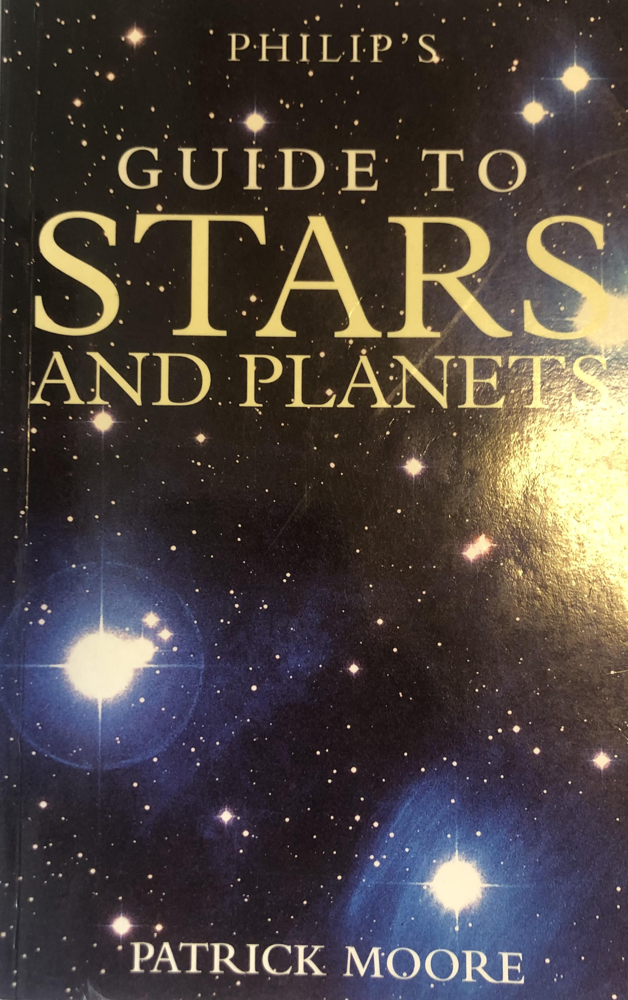
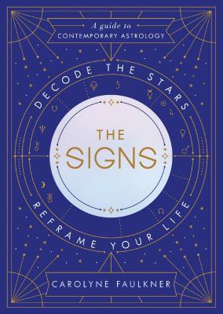

Spirituality literature covers a wide range of subjects, from religion to crystal work to astrology. However, given the fact that spiritualities are based largely on a set of beliefs rather than proven facts, such subjects are not considered science. This means that while geology (the study of rocks) is considered a science, crystal healing (the practise of using crystal 'chakra' or energy to heal or channel certain energies) is not. Similarly, astronomy (the study of the planets and stars) is considered a science but astrology (the practice of using planetary movements to determine and predict outcomes and behaviours) is considered to be more of a spiritual study. This naturally means that such topics are written as entirely different genres, and so the designs of their book covers tend to differ quite a lot.

## Philip's Guide to Stars and Planets

*Philip's Guide to Stars and Planets* by Sir Patrick Moor is an informative scientific book on astronomy, covering aspects of the subject such as our solar system, the stars, galaxies and constellations with numerous maps of various astronomical systems. The cover features a full page background image of a dark blue starry sky under white text stating the name and authorship. This choice in cover design immediately establishes the book's status as non-fiction and scientific, providing a no-nonsense cover without flashy colours or overly pretentious fonts to catch the eye of browsers. That is not to say that the typeface lacks any personality of course; the all-caps, serifed letters provide a professional and sophisticated air that matches the formal, factual voice of the book.

## The Signs

A first glance at the cover design of *The Signs* by Carolyne Faulkner instantly gives the impression that the book is more spiritual than scientific. The contrast of the geometric gold lines and stars against the navy blue background is reminiscent of a night sky while the gold design itself that encircles the book's title mimics that of a birth or natal chart, particularly aided by the symbols for the different planets (not to be confused with the symbols for the star signs). The cover design for this book is much busier than *Philip's Guide to Stars and Planets* but the geometricity of its layout avoids it from becoming overwhelming, instead providing a modern but mystical vibe.

##### Find the Books on Goodreads:

*Philip's Guide to Stars and Planets -* <https://www.goodreads.com/book/show/6112199-guide-to-stars-and-planets> 

*The Signs -* <https://www.goodreads.com/book/show/36700654-the-signs>