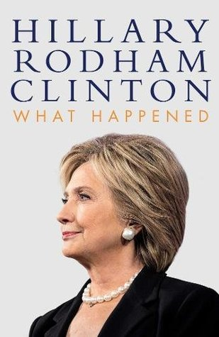

Autobiographies have long been used by public figures as a way of documenting their journey to the limelight and important moments in their lives or careers. Whether ghost-written or self-written, writing an autobiography or memoir seems to have become a rite of passage for public figures; from the memoirs of politicians such as Margaret Thatcher (former UK Prime Minister from 1979-1990) to the juicy tell-alls of reality stars such as Erika Jayne (Real Housewives of Beverly Hills star from 2015-present), they seem a popular source of income for both the public figure and the publisher. Of course, the tone of a political memoir would be vastly different from a reality star's, and this is where typography and cover design comes in.

## What Happened

The former US Secretary of State Hillary Rodham Clinton's autobiography *What Happened* is a political memoir that recounts her experience running against Donald Trump in the 2016 US presidential election. The front cover features a white background, a cut out image of Clinton from the shoulders up covering the bottom half of the page and the title and authorship of the book covering the top half. In the photo Clinton is angled left, facing away from the camera and wearing a black suit and pearl jewellery that is typical of a politician or businesswoman. This immediately enforces the fact that the book is regarding something to do with Clinton's political career. 

The typography of the cover then reinforces that in a number of ways. Clinton's name is printed larger than the title of the book as potential readers are more likely to pick up the book if they see who it is about rather than what it is about because of her social and political status, particularly at the time when the book was published, than a year after she lost the presidential election. The navy blue choice for her name combined with the capitalised and serifed structure of the font provides connotations of power, professionalism and importance that matches the seriousness of political topics end events. Meanwhile, the rest of the text is just as structured and capitalised but smaller and without the serifs, as well as designed in a copper colour rather than the navy blue of the author's name. This allows the text to match the orderly theme of the rest of the cover without detracting immediate attention from Clinton's name. The use of copper also provides a sense of importance and value in the the topic of the book while also seeming welcoming and unconfrontational, as it might seem had a colder metal colour such as gold or silver been used.

## I Hate Everyone, Except You

The cover design for American tv personality Clinton Kelly's autobiography *I Hate Everyone, Except You* is drastically different to *What Happened*, and rightly so. The main feature of the cover is a rather gruff looking yellow and green bird, over which the title and authorship of the book is written in a seemingly random, unstructured placement. The colourful nature of the bird establishes an air of flamboyance and comedy that matches Kelly's television personality status and the tone of the book's topics, something which is aided by the gruff, hostile expression of the bird which also matches the title of the book and directly contrasts the solemn, serious tones of *What Happened.*

The text is black and highlighted white, while the typeface is cursive and of a handwritten style. This is a much more informal and relaxed typeface than Hillary Clinton's serifed, serious typeface, suggesting a much more personal, almost diary-like style of autobiography than the carefully written political memoirs of Clinton.

In conclusion then, despite both books being autobiographies the status and profession of the author greatly impacts the tone of each book and the design of the front covers reflect that, with Kelly's tv personality autobiography being much more relaxed and comedic than Clinton's structured and politically respectable cover.

##### Find the Books on Goodreads:

*What Happened* - <https://www.goodreads.com/book/show/36125495-what-happened> 

*I Hate Everyone, Except You* - <https://www.goodreads.com/book/show/29430846-i-hate-everyone-except-you>