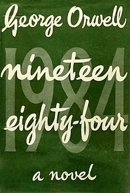

Dystopian novels have been a relatively popular genre of fiction since the early 1900s; with *We* by Yevgeny Zamyatin acclaimed as the first dystopian novel. More well-known titles within the genre include *Fahrenheit 451* by Ray Bradbury, *Nineteen Eighty-Four* by George Orwell and the more recent series *The Hunger Games* by Suzanne Collins. Most dystopian novels feature a totalitarian or authoritarian society that oppresses one or many groups within that society. The authorities within such plots tend to rule through extreme invasions of privacy and control via methods not dissimilar to things that are within societies around the world now; collection of individuals' technological data, policing of women's bodies and withholding/banning information that goes against those in power - those who are anti-establishment are punished. As with all literature, the designs and typography for dystopian book covers has changed somewhat since the earlier novels within the genre. As society and politics has changed and technology has developed into an increasingly bigger part of our lives dystopian plots have changed focus slightly, and the designs for their covers have altered accordingly.

## Nineteen Eighty-Four

George Orwell's 1949 novel *Nineteen Eighty-Four* follows the story of a secretly anti-establishment rank-and-file worker and member of the Party (the authority in power) in an imagined futuristic Europe held under a Stalin-esque totalitarian state. There isn't much room within the book's societal regime for personal choice and individuality, and this is very much reflected in the first edition's front cover. Text stating the name of the book and the authorship covers the expanse of the front design, leaving no room for images or additional text, much like the restrictive nature of the plot's setting. There is also a rigid structure to the text; centrally aligned and in straight lines that go from the left margin to the right, yet there is a layering of the book's title with 1984 written in both numerical and alphabetical form. This throws into question the true form of the title, just as the protagonist of the book questions the system - does Big Brother really exist? Is there a way out of this society?

This representation is furthered through the typefaces of the cover. The first font used is a bold, cursive typeface for the front layer of text displaying the authorship and alphabetical title of the book. The easy flowing style of it is similar to the almost utopian nature of society dystopian states often try to brainwash their citizens into believing is real; a front or mirage hiding the atrocities committed behind the screen. Meanwhile the second font (used for the background layer of text for the numerical version of the title) is around five times bigger and a bold, lightly serifed font. The typeface combined with the military green background is reminiscent of war propaganda, presenting a sense of warning, danger and conflict that matches the plot's setting in a war-ridden Europe controlled through lies and manipulation that provide a mask of harmony.

## Followers

*Followers* by Megan Angelo is set in a world where government appointed celebrities are expected to live their entire lives on screen for the entertainment of their followers. It follows the story of one such celebrity Marlow who, like the protagonist of *1984*, wishes to escape her role in the society she lives in. The novel provides a dark caricature of reality television culture, a concept also used in Collins' 2008 trilogy *The Hunger Games* continuing the trend of technology being used as a weapon in dystopian stories.

The colour scheme for *Followers'* first edition cover is vastly different to that of *1984's*; while *1984* has just one dark shade of green on the cover *Followers* opts for a range of shades from pale pastel pink to navy blue. The colours are used in a geometrically designed image of three female silhouettes stood side by side and facing the right-hand border of the book. The colours contrast with the dark nature of the book's plot and yet still manage to reflect the bubbly and flashy nature of reality television, fitting the general theme of dystopians in which truth is often hidden behind a shiny mirage. 

As with *1984*, the typography for *Followers* uses two different typefaces; one bold and cursive and one bold and printed. The title of the novel is cursive and the light, flowing strokes of the letters again correlate with the idea of the truth being hidden behind elaborate lies, creating false priorities to distract from the immoral goings-on within the plot, this time through followers the celebrities amass. Meanwhile, the subtitle of the novel, '*some things aren't meant to be shared'* is written in an all capsulated, bold non-serifed font, providing a serious tone to the words that is not evident in the frivolity of the title, again demonstrating the lies behind which dystopian authorities often hide behind.

In conclusion, while book covers have been more colourful and decorative for dystopian novels over time, the general typography has remained similar, fitting 

##### Find The Books on Goodreads:

*Nineteen Eighty-Four -* <https://www.goodreads.com/book/show/55048991-1984> 

*Followers -* <https://www.goodreads.com/book/show/42171136-followers>