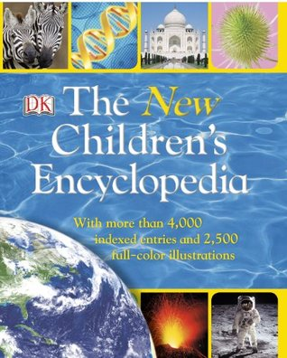

Before the age of the internet encyclopaedias were a major source of extra-curricular learning for children and adults alike, available in the form of individual bumper books about a whole topic (such as history for children) or multiple volume collections. Since the growth of the world wide web however encyclopaedia sales have naturally declined; with the answer to any question just a few clicks away people are less inclined to fill their bookshelves with thick books of general knowledge. In fact, in 2012 Encyclopaedia Britannica completely shut down its publication of bound encyclopaedias, moving entirely online after sales decreased dramatically in the early Nineties (though they do still appear to be publishing children's encyclopaedias). Other notable encyclopaedia publishers of the 20th and 21st Century include Usborne and DK Publishers, both of which are also both online and still print children's encyclopaedias. For those that do still publish print versions of their encyclopaedias, typography and the design of their book covers is just as, if not more important in attracting buyers as it was thirty years ago. 

## DK The New Children's Encyclopedia

*The New Children's Encyclopedia* by DK Publishers was published in 2013 and covers a range of subjects key to a child's academic learning such as geography, history, and science, DK's books are often used within classrooms for teaching. The book is aimed at children around the age of 11 and so its cover layout is more formal than fun with images relating to its topics neatly placed in structured boxes at the top and bottom of the page, but the choice of bright colours such as blue and yellow still allow it to stand out and engage the interest of its young readers. 

The typeface design of the cover equally matches this impression of being academic but engaging, also through the use of colour as well as font. The title is a simple white that compliments the blue of the wave image used as a background, while the subtitle and the word 'New' is highlighted yellow. It is the same yellow used to outline and separate the cover images, allowing the highlighted  text to catch the eye of the reader without it jarring from the rest of the design. The font used is Goudy Old Style, a serifed typeface commonly used by a number of universities, as well as being the standard body text font for Key Club publications and the cover typeface for Harper Magazine. It is evident therefore that it is most used in a professional/academic setting. In the context of this book the serifs provide an academic air, while the boldness highlights the way the lines thin as they at the joints of the letters and widen at the curves creating a subtle almost bubble-like effect that prevents it from appearing too serious.

Overall the design of the cover design is accurate and engaging for a young student, particularly in a classroom setting with the use of bright primary colours and a font that toes the line between professional and fun.

##### Find the Book on Goodreads:

*The New Children's Encyclopedia -* <https://www.goodreads.com/book/show/18387570-the-new-children-s-encyclopedia>